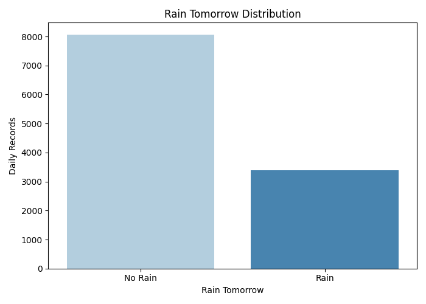
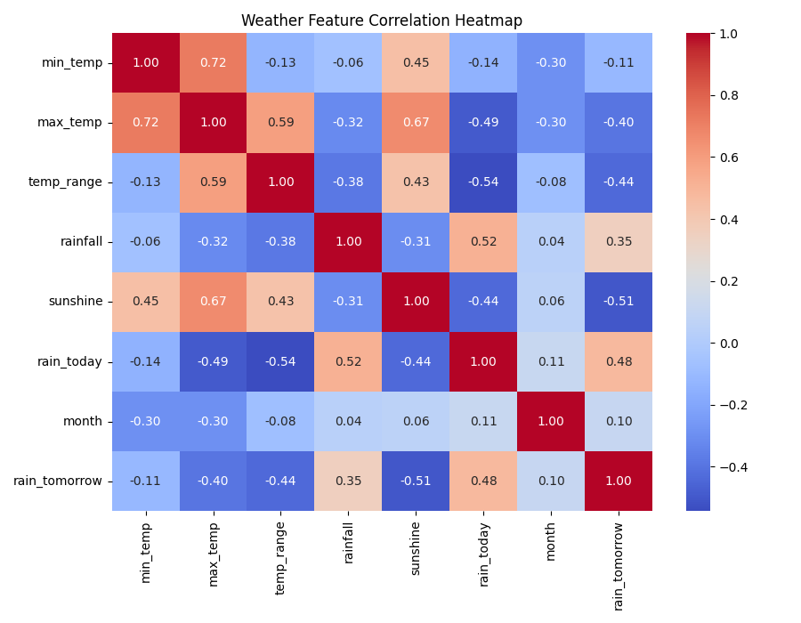
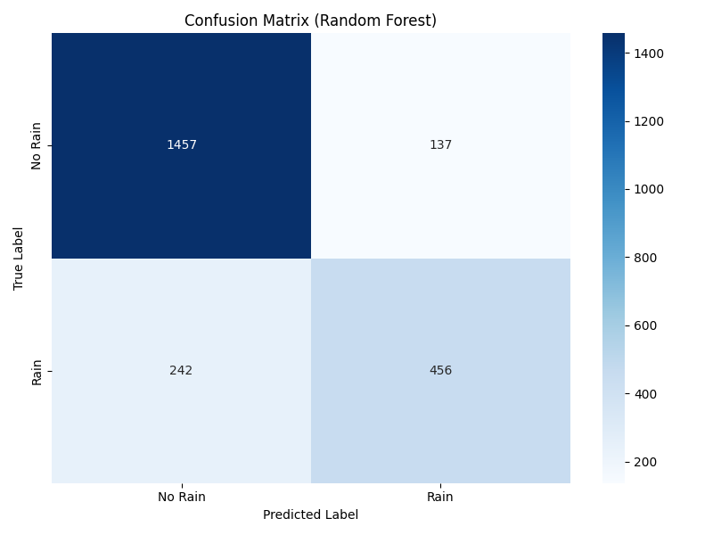
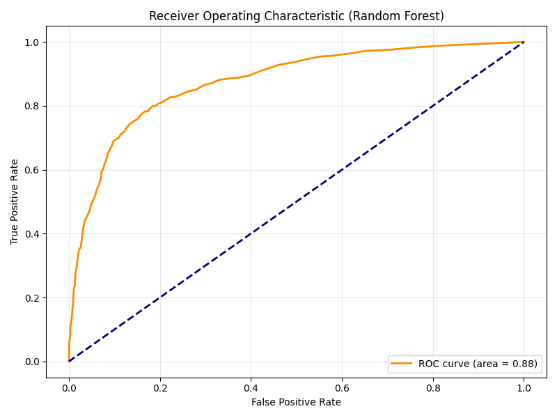
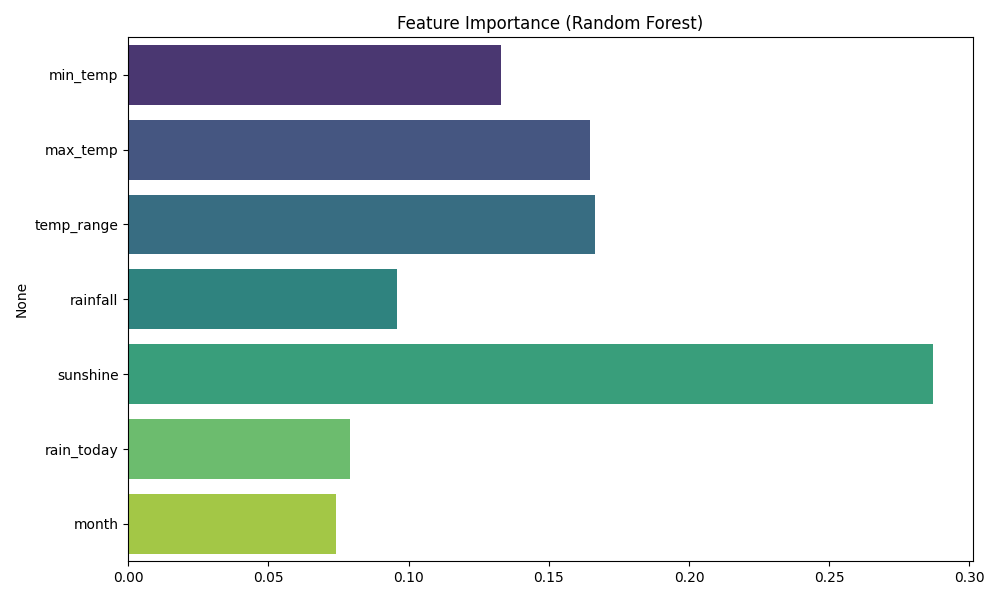

# RainTomorrow-ML

This project builds a machine learning pipeline to predict whether it will rain tomorrow using historical daily weather observations.
The dataset combines daily minimum temperature, maximum temperature, rainfall, and sunshine records into a binary classification target: `rain_tomorrow`.

## Project Highlights

- Merged multiple raw weather data files into one modelling dataset.
- Created binary labels for `rain_today` and `rain_tomorrow`.
- Engineered extra features including `month` and `temp_range`.
- Compared Logistic Regression and Random Forest classifiers.
- Evaluated the selected model with a classification report, confusion matrix, ROC curve, and feature-importance chart.

## Repository Structure

```text
.
├── data/
│   ├── raw/                 # Source weather CSV files and notes
│   └── processed/           # Cleaned modelling dataset
├── experiments/             # Optional experimental scripts
├── outputs/                 # Generated charts
├── src/
│   ├── merge_weather_data.py
│   └── train_rain_model.py
├── requirements.txt
└── README.md
```

## Dataset

The processed dataset contains 11,458 daily records from 1994-01-01 to 2026-04-11.

Features used by the main model:

- `min_temp`
- `max_temp`
- `temp_range`
- `rainfall`
- `sunshine`
- `rain_today`
- `month`

Target:

- `rain_tomorrow`: 1 if rainfall is recorded on the next day, otherwise 0.

## Models

The main training script compares:

- Logistic Regression with balanced class weights
- Random Forest Classifier with balanced class weights

The best model is selected by test accuracy, then diagnostic plots are generated.

## Current Results

On the current train/test split, Random Forest was selected as the best model:

- Logistic Regression accuracy: 0.8128
- Random Forest accuracy: 0.8346
- Random Forest rain-class recall: 0.65
- Random Forest rain-class F1-score: 0.71

## Visualisations

The project generates exploratory and model-evaluation visualisations in the `outputs/` directory.

### Rain Tomorrow Distribution

Shows the class balance between days with no rain tomorrow and days with rain tomorrow.



### Feature Correlation Heatmap

Shows relationships between weather features and the `rain_tomorrow` target.



### Confusion Matrix

Shows how many test records were correctly or incorrectly classified as rain / no rain.



### ROC Curve

Shows the trade-off between true positive rate and false positive rate across classification thresholds.



### Feature Importance

Shows which features contributed most to the selected Random Forest model.



## How to Run

Create and activate a virtual environment:

```bash
python -m venv .venv
source .venv/bin/activate
```

Install dependencies:

```bash
pip install -r requirements.txt
```

Rebuild the processed dataset from raw CSV files:

```bash
python src/merge_weather_data.py
```

Train and evaluate the model:

```bash
python src/train_rain_model.py
```

Generated plots will be saved in `outputs/`.

## Outputs

- `outputs/confusion_matrix.png`
- `outputs/roc_curve.png`
- `outputs/feature_importance.png`
- `outputs/correlation_heatmap.png`
- `outputs/rain_distribution.png`

## Limitations

- The current model uses a random train/test split, so it is a learning project rather than a production weather forecasting system.
- The prediction is based on a limited set of historical weather features and does not include modern forecast variables such as pressure systems, radar data, or satellite observations.
- Results may not generalise to other locations without collecting and retraining on location-specific data.

## Example Use Case

The trained model can estimate the probability of rain tomorrow from a small set of daily weather inputs such as temperature, rainfall, sunshine, rain-today status, and month.
